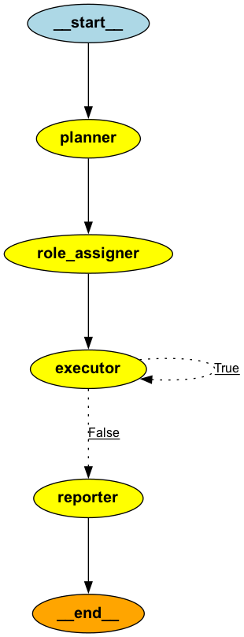
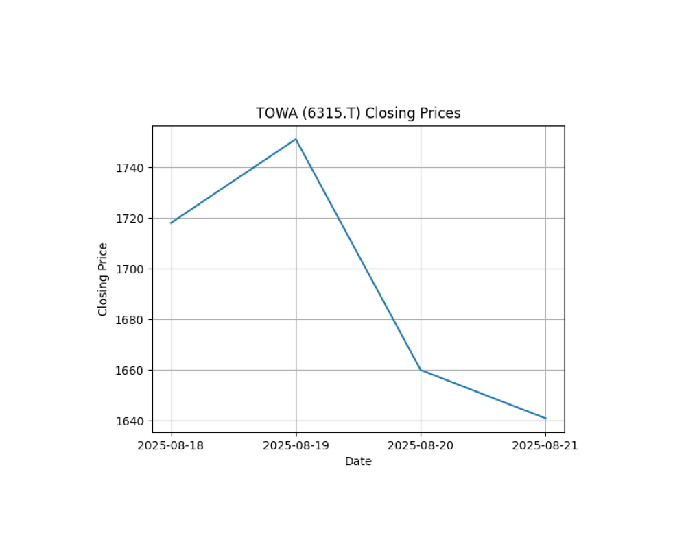
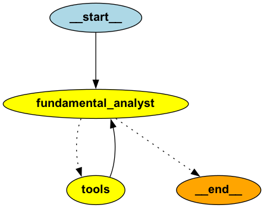

# sample-ai-agent

## グラフ構造をビジュアライズして表示する

    $ uv run draw_graph.py

## 第9章 LangGraphで作るAIエージェント実践入門

### 1. ハンズオン：Q&Aアプリケーション

    $ uv run ai_agent_01_for_q_and_a_app.py

### 2. チェックポイント機能：ステートの永続化と再開

    $ uv run ai_agent_02_for_confirm_checkpoint.py

## 第10章 要件定義書 生成AIエージェントの開発

### 3. エージェントの実行と結果の確認

    $ uv run ai_agent_03_for_reqirement_system.py --task スマートフォン向けの健康管理アプリを開発したい

## 第12章 LangChain/LangGraphで実装するエージェントデザインパターン

### 4. パッシブゴールクリエイター

    $ uv run ai_agent_04_for_passive_goal_creator.py --task カレーライスの作り方

### 5. プロンプト最適化

    $ uv run ai_agent_05_for_prompt_optimizer.py --task カレーライスの作り方

### 6. レスポンス最適化

    $ uv run ai_agent_06_for_response_optimizer.py --task カレーライスの作り方

### 7. シングルパスプランジェネレーター

    $ uv run ai_agent_07_for_single_path_plan_generation.py --task カレーライスの作り方

### 8. マルチパスプランジェネレーター

    $ uv run ai_agent_08_for_multi_path_plan_generation.py --task カレーライスの作り方

### 9. セルフリフレクション

    $ uv run ai_agent_09_for_self_reflection.py --task カレーライスの作り方

### 10. クロスリフレクション

... snip

### 11. 役割ベースの協調

    $ uv run ai_agent_11_for_role_based_cooperation.py --task カレーライスの作り方

## MCPサーバと連携させてみる

### 12. シングルサーバ

    $ uv run ai_agent_12_for_stock_data_single_server.py --task "2025年8月18から2025年8月22日までのTOWA(6315.T)の株の日次の終値を取得してください"
    [08/24/25 17:16:10] INFO     Processing request of type ListToolsRequest                                                                                         server.py:624
    [08/24/25 17:16:11] INFO     Processing request of type CallToolRequest                                                                                          server.py:624
    2025年8月18日から2025年8月22日までのTOWA(6315.T)の日次の終値は以下の通りです。
    2025-08-18: 1718.0
    2025-08-19: 1751.0
    2025-08-20: 1660.0
    2025-08-21: 1641.0

### 13. マルチサーバ

    % uv run ai_agent_13_for_stock_data_multi_server.py --task "2025年8月18から2025年8月22日までのTOWA(6315.T)の株の日次の終値を取得し、その値を使  っ てmatplotlibのチャートを作成してください。"
    [08/24/25 18:21:09] INFO     Processing request of type ListToolsRequest                                                                                         server.py:624
    [08/24/25 18:21:09] INFO     Processing request of type ListToolsRequest                                                                                         server.py:624
    WARNING: All log messages before absl::InitializeLog() is called are written to STDERR
    I0000 00:00:1756027270.912556  162877 fork_posix.cc:71] Other threads are currently calling into gRPC, skipping fork() handlers
    [08/24/25 18:21:11] INFO     Processing request of type CallToolRequest                                                                                          server.py:624
                        INFO     Processing request of type ListToolsRequest                                                                                         server.py:624
    I0000 00:00:1756027274.486624  162877 fork_posix.cc:71] Other threads are currently calling into gRPC, skipping fork() handlers
    [08/24/25 18:21:14] INFO     Processing request of type CallToolRequest                                                                                          server.py:624
                        INFO     Using categorical units to plot a list of strings that are all parsable as floats or dates. If these strings should be plotted as category.py:224
                                 numbers, cast to the appropriate data type before plotting.
                        INFO     Using categorical units to plot a list of strings that are all parsable as floats or dates. If these strings should be plotted as category.py:224
                                 numbers, cast to the appropriate data type before plotting.
                        INFO     Warning: UserWarning: FigureCanvasAgg is non-interactive, and thus cannot be shown                                                  server.py:614
                        INFO     Processing request of type ListToolsRequest                                                                                         server.py:624
    TOWA(6315.T)の2025年8月18日から2025年8月21日までの株価データは以下の通りです。

    日付 | 終値
    ---|---
    2025-08-18 | 1718.0
    2025-08-19 | 1751.0
    2025-08-20 | 1660.0
    2025-08-21 | 1641.0

    2025年8月22日のデータがありません。

    上記の株価データを使ってmatplotlibのチャートを作成します。

## 銘柄を分析してみる

### 14. tool callingベース

    $ uv run ai_agent_14_for_stock_analysis.py --ticker 6315.T

