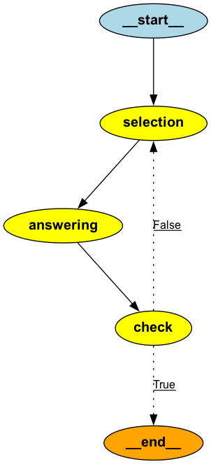
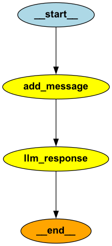
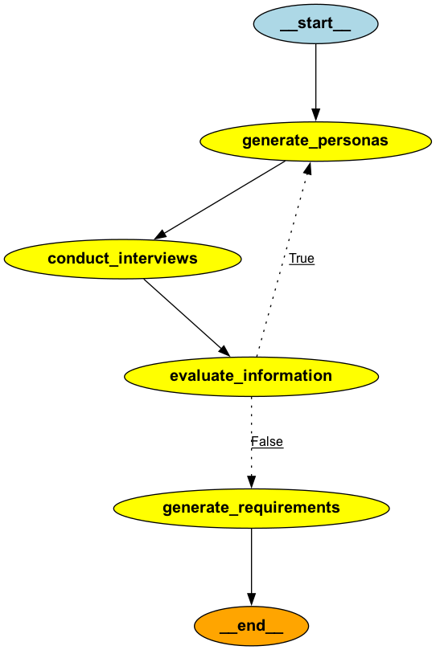
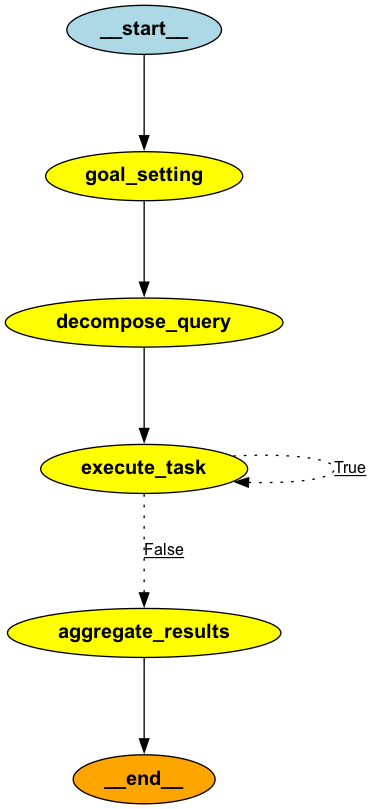
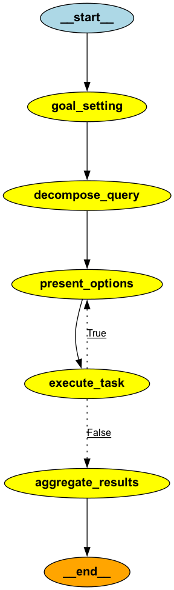
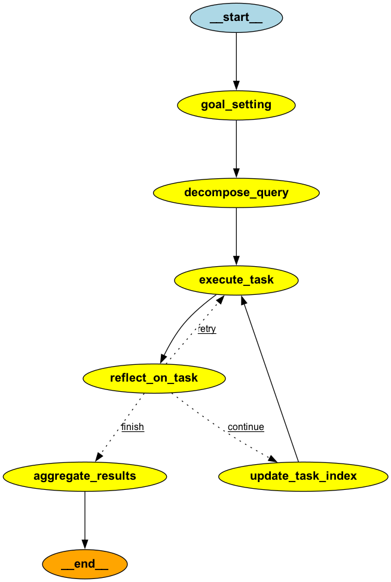

# sample-ai-agent

## グラフ構造をビジュアライズして表示する

    $ uv run draw_graph.py

## 第9章 LangGraphで作るAIエージェント実践入門

### 1. ハンズオン：Q&Aアプリケーション

    $ uv run ai_agent_01_for_q_and_a_app.py

### 2. チェックポイント機能：ステートの永続化と再開

    $ uv run ai_agent_02_for_confirm_checkpoint.py

## 第10章 要件定義書 生成AIエージェントの開発

### 3. エージェントの実行と結果の確認

    $ uv run ai_agent_03_for_reqirement_system.py --task スマートフォン向けの健康管理アプリを開発したい

## 第12章 LangChain/LangGraphで実装するエージェントデザインパターン

### 4. パッシブゴールクリエイター

    $ uv run ai_agent_04_for_passive_goal_creator.py --task カレーライスの作り方

### 5. プロンプト最適化

    $ uv run ai_agent_05_for_prompt_optimizer.py --task カレーライスの作り方

### 6. レスポンス最適化

    $ uv run ai_agent_06_for_response_optimizer.py --task カレーライスの作り方

### 7. シングルパスプランジェネレーター

    $ uv run ai_agent_07_for_single_path_plan_generation.py --task カレーライスの作り方

### 8. マルチパスプランジェネレーター

    $ uv run ai_agent_08_for_multi_path_plan_generation.py --task カレーライスの作り方

### 9. セルフリフレクション

    $ uv run ai_agent_09_for_self_reflection.py --task カレーライスの作り方

